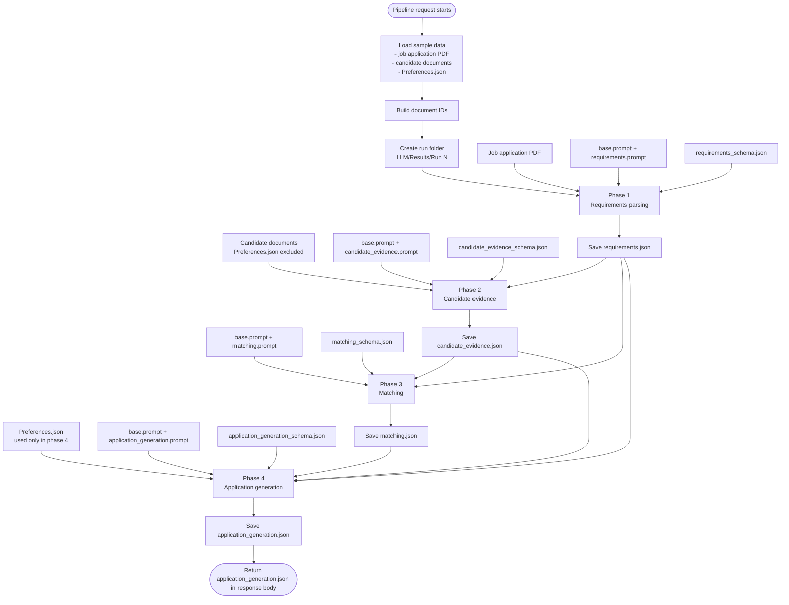
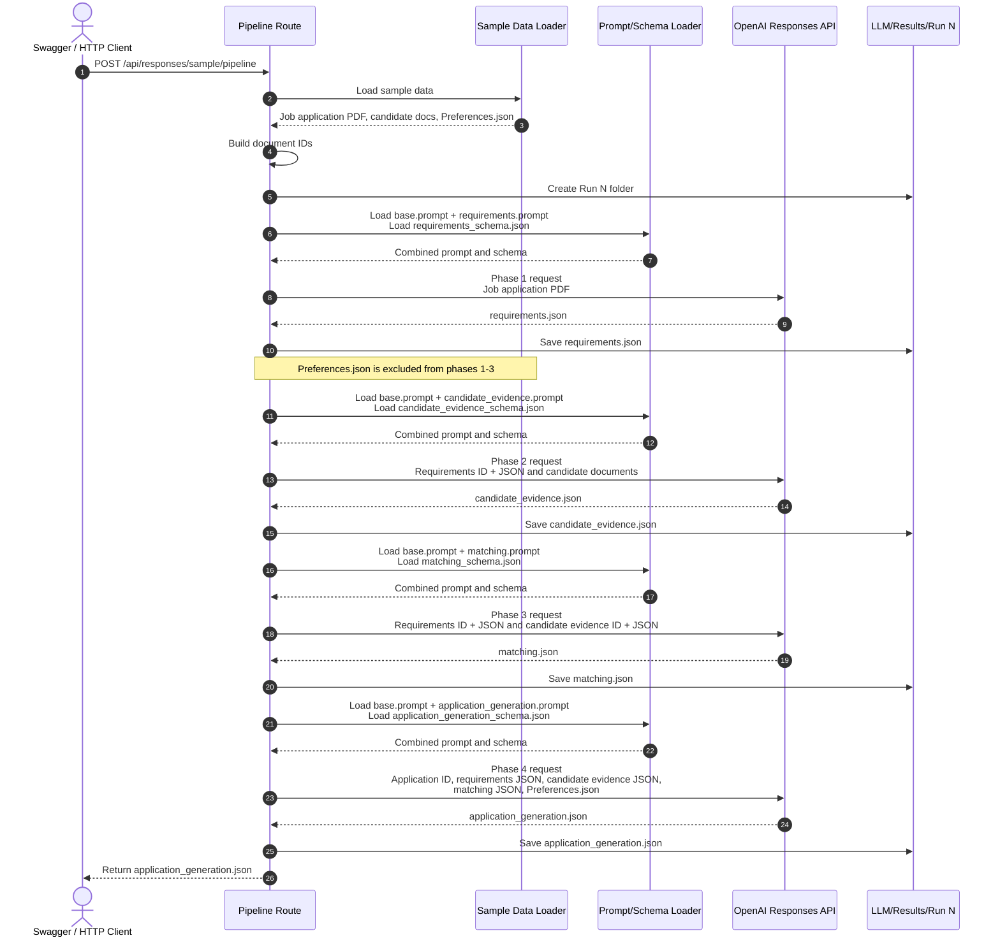
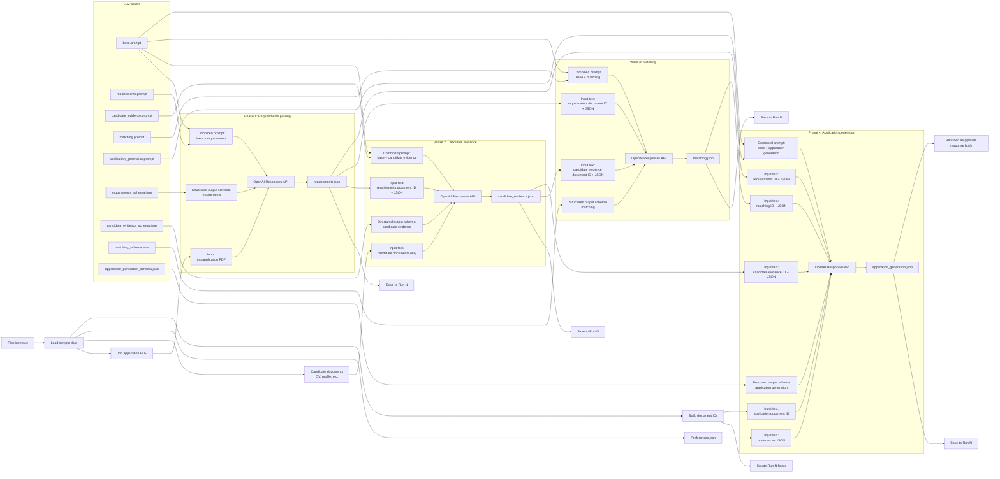

# Pipeline Diagram

This document visualizes the current implemented sample pipeline in OpenAiResponses.Api.

## Flowchart

```mermaid
flowchart TD
    start([Pipeline request starts]) --> load["Load sample data<br/>- job application PDF<br/>- candidate documents<br/>- Preferences.json"]
    load --> ids["Build document IDs"]
    ids --> run["Create run folder<br/>LLM/Results/Run N"]

    job["Job application PDF"]
    candidateDocs["Candidate documents<br/>Preferences.json excluded"]
    preferences["Preferences.json<br/>used only in phase 4"]
    reqPrompt["base.prompt + requirements.prompt"]
    reqSchema["requirements_schema.json"]
    evidencePrompt["base.prompt + candidate_evidence.prompt"]
    evidenceSchema["candidate_evidence_schema.json"]
    matchPrompt["base.prompt + matching.prompt"]
    matchSchema["matching_schema.json"]
    appPrompt["base.prompt + application_generation.prompt"]
    appSchema["application_generation_schema.json"]

    run --> phase1["Phase 1<br/>Requirements parsing"]
    job --> phase1
    reqPrompt --> phase1
    reqSchema --> phase1
    phase1 --> save1["Save requirements.json"]

    save1 --> phase2["Phase 2<br/>Candidate evidence"]
    candidateDocs --> phase2
    evidencePrompt --> phase2
    evidenceSchema --> phase2
    phase2 --> save2["Save candidate_evidence.json"]

    save1 --> phase3["Phase 3<br/>Matching"]
    save2 --> phase3
    matchPrompt --> phase3
    matchSchema --> phase3
    phase3 --> save3["Save matching.json"]

    save1 --> phase4["Phase 4<br/>Application generation"]
    save2 --> phase4
    save3 --> phase4
    preferences --> phase4
    appPrompt --> phase4
    appSchema --> phase4
    phase4 --> save4["Save application_generation.json"]

    save4 --> response([Return application_generation.json in response body])
```

## Sequence Diagram

```mermaid
sequenceDiagram
    autonumber
    actor Client as Swagger / HTTP Client
    participant Route as Pipeline Route
    participant Sample as Sample Data Loader
    participant Assets as Prompt/Schema Loader
    participant OpenAI as OpenAI Responses API
    participant Results as LLM/Results/Run N

    Client->>Route: POST /api/responses/sample/pipeline
    Route->>Sample: Load sample data
    Sample-->>Route: Job application PDF, candidate docs, Preferences.json
    Route->>Route: Build document IDs
    Route->>Results: Create Run N folder

    Route->>Assets: Load base.prompt + requirements.prompt<br/>Load requirements_schema.json
    Assets-->>Route: Combined prompt and schema
    Route->>OpenAI: Phase 1 request<br/>Job application PDF
    OpenAI-->>Route: requirements.json
    Route->>Results: Save requirements.json

    Note over Route,Sample: Preferences.json is excluded from phases 1-3

    Route->>Assets: Load base.prompt + candidate_evidence.prompt<br/>Load candidate_evidence_schema.json
    Assets-->>Route: Combined prompt and schema
    Route->>OpenAI: Phase 2 request<br/>Requirements ID + JSON and candidate documents
    OpenAI-->>Route: candidate_evidence.json
    Route->>Results: Save candidate_evidence.json

    Route->>Assets: Load base.prompt + matching.prompt<br/>Load matching_schema.json
    Assets-->>Route: Combined prompt and schema
    Route->>OpenAI: Phase 3 request<br/>Requirements ID + JSON and candidate evidence ID + JSON
    OpenAI-->>Route: matching.json
    Route->>Results: Save matching.json

    Route->>Assets: Load base.prompt + application_generation.prompt<br/>Load application_generation_schema.json
    Assets-->>Route: Combined prompt and schema
    Route->>OpenAI: Phase 4 request<br/>Application ID, requirements JSON, candidate evidence JSON,<br/>matching JSON, Preferences.json
    OpenAI-->>Route: application_generation.json
    Route->>Results: Save application_generation.json

    Route-->>Client: Return application_generation.json
```

## Detailed Phase I/O

```mermaid
flowchart LR
    route["Pipeline route"] --> sample["Load sample data"]
    sample --> job["Job application PDF"]
    sample --> candidateDocs["Candidate documents<br/>CV, profile, etc."]
    sample --> prefs["Preferences.json"]
    sample --> ids["Build document IDs"]
    ids --> runDir["Create Run N folder"]

    subgraph Assets["LLM assets"]
        base["base.prompt"]
        reqPrompt["requirements.prompt"]
        evidencePrompt["candidate_evidence.prompt"]
        matchPrompt["matching.prompt"]
        appPrompt["application_generation.prompt"]
        reqSchema["requirements_schema.json"]
        evidenceSchema["candidate_evidence_schema.json"]
        matchSchema["matching_schema.json"]
        appSchema["application_generation_schema.json"]
    end

    subgraph Phase1["Phase 1: Requirements parsing"]
        p1In["Input:<br/>job application PDF"]
        p1Prompt["Combined prompt:<br/>base + requirements"]
        p1Schema["Structured output schema:<br/>requirements"]
        p1Call["OpenAI Responses API"]
        p1Out["requirements.json"]
    end

    job --> p1In
    base --> p1Prompt
    reqPrompt --> p1Prompt
    reqSchema --> p1Schema
    p1In --> p1Call
    p1Prompt --> p1Call
    p1Schema --> p1Call
    p1Call --> p1Out
    p1Out --> save1["Save to Run N"]

    subgraph Phase2["Phase 2: Candidate evidence"]
        p2In1["Input text:<br/>requirements document ID + JSON"]
        p2In2["Input files:<br/>candidate documents only"]
        p2Prompt["Combined prompt:<br/>base + candidate evidence"]
        p2Schema["Structured output schema:<br/>candidate evidence"]
        p2Call["OpenAI Responses API"]
        p2Out["candidate_evidence.json"]
    end

    p1Out --> p2In1
    candidateDocs --> p2In2
    base --> p2Prompt
    evidencePrompt --> p2Prompt
    evidenceSchema --> p2Schema
    p2In1 --> p2Call
    p2In2 --> p2Call
    p2Prompt --> p2Call
    p2Schema --> p2Call
    p2Call --> p2Out
    p2Out --> save2["Save to Run N"]

    subgraph Phase3["Phase 3: Matching"]
        p3In1["Input text:<br/>requirements document ID + JSON"]
        p3In2["Input text:<br/>candidate evidence document ID + JSON"]
        p3Prompt["Combined prompt:<br/>base + matching"]
        p3Schema["Structured output schema:<br/>matching"]
        p3Call["OpenAI Responses API"]
        p3Out["matching.json"]
    end

    p1Out --> p3In1
    p2Out --> p3In2
    base --> p3Prompt
    matchPrompt --> p3Prompt
    matchSchema --> p3Schema
    p3In1 --> p3Call
    p3In2 --> p3Call
    p3Prompt --> p3Call
    p3Schema --> p3Call
    p3Call --> p3Out
    p3Out --> save3["Save to Run N"]

    subgraph Phase4["Phase 4: Application generation"]
        p4In1["Input text:<br/>requirements ID + JSON"]
        p4In2["Input text:<br/>candidate evidence ID + JSON"]
        p4In3["Input text:<br/>matching ID + JSON"]
        p4In4["Input text:<br/>application document ID"]
        p4In5["Input text:<br/>preferences JSON"]
        p4Prompt["Combined prompt:<br/>base + application generation"]
        p4Schema["Structured output schema:<br/>application generation"]
        p4Call["OpenAI Responses API"]
        p4Out["application_generation.json"]
    end

    p1Out --> p4In1
    p2Out --> p4In2
    p3Out --> p4In3
    ids --> p4In4
    prefs --> p4In5
    base --> p4Prompt
    appPrompt --> p4Prompt
    appSchema --> p4Schema
    p4In1 --> p4Call
    p4In2 --> p4Call
    p4In3 --> p4Call
    p4In4 --> p4Call
    p4In5 --> p4Call
    p4Prompt --> p4Call
    p4Schema --> p4Call
    p4Call --> p4Out
    p4Out --> save4["Save to Run N"]
    p4Out --> swagger["Returned as pipeline response body"]
```