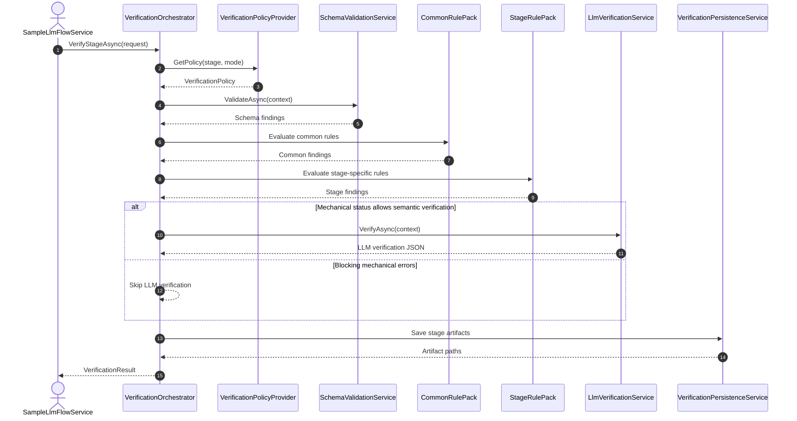
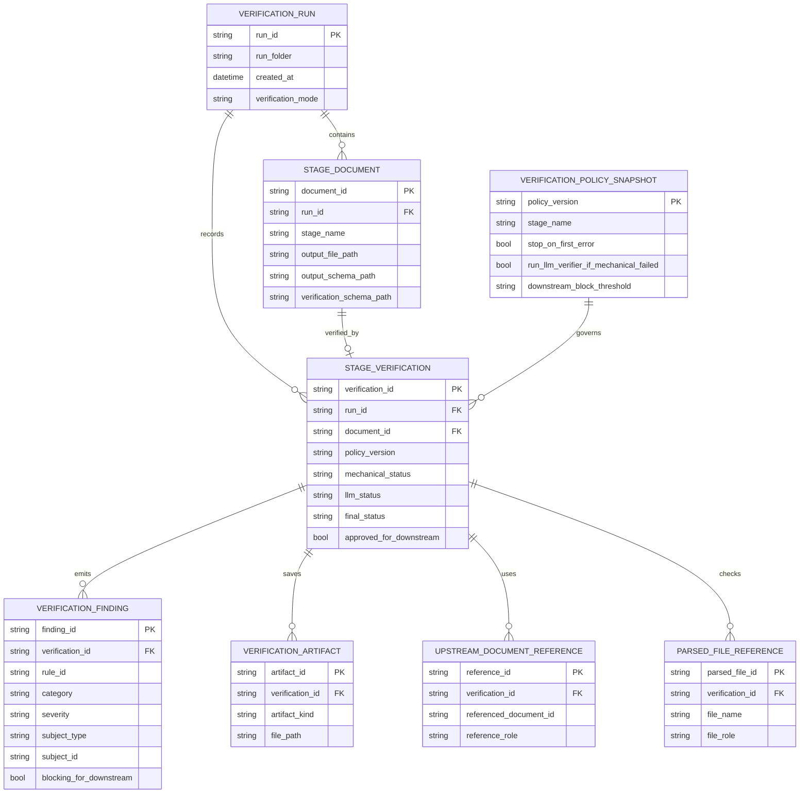

# Verification Implementation Checklist

Dette dokument omsætter verification-planen til en mere konkret implementeringsskitse med foreslåede filer, interfaces, klasser og en realistisk implementeringsrækkefølge.

Dele af mechanical verification er nu implementeret. Dokumentet fungerer derfor som en design- og udbygningscheckliste for næste iterationer, ikke som en beskrivelse af en helt tom løsning.

Repair-first udvidelsen er beskrevet mere specifikt i [verification repair plan.md](verification%20repair%20plan.md). Denne checkliste dækker grundlaget, som repair-loopet skal bygges oven på.

## Formål

Målet er at gøre næste implementeringsrunde mekanisk og lav-risiko ved at beslutte:

- hvilke filer der bør oprettes
- hvilke interfaces der skal eksistere
- hvilke kerneklasser der skal have ansvar for hvad
- hvordan data strømmer gennem verifieringslaget
- hvordan verification artifacts bør modelleres og gemmes

## Foreslået filstruktur

```text
Tests/OpenAiResponses.Api/
  Models/
    Verification/
      VerificationStage.cs
      VerificationMode.cs
      VerificationSeverity.cs
      VerificationCategory.cs
      VerificationRequest.cs
      VerificationContext.cs
      VerificationPolicy.cs
      VerificationSummary.cs
      VerificationFinding.cs
      VerificationResult.cs
      VerificationArtifactPaths.cs
      UpstreamDocumentReference.cs
      ParsedFileReference.cs
      VerificationRuleResult.cs

  Services/
    Verification/
      IVerificationOrchestrator.cs
      VerificationOrchestrator.cs
      IMechanicalVerificationService.cs
      MechanicalVerificationService.cs
      ILlmVerificationService.cs
      LlmVerificationService.cs
      ISchemaValidationService.cs
      SchemaValidationService.cs
      IVerificationPersistenceService.cs
      VerificationPersistenceService.cs
      IVerificationPolicyProvider.cs
      VerificationPolicyProvider.cs
      IDocumentReferenceIndexFactory.cs
      DocumentReferenceIndexFactory.cs
      IWhitespaceNormalizationService.cs
      WhitespaceNormalizationService.cs

      RulePacks/
        IRulePack.cs
        IVerificationRule.cs
        CommonRulePack.cs
        RequirementsRulePack.cs
        CandidateEvidenceRulePack.cs
        MatchingRulePack.cs
        ApplicationGenerationRulePack.cs

      Rules/
        Common/
          JsonParseRule.cs
          RootObjectRule.cs
          SchemaValidationRule.cs
          MetadataPresenceRule.cs
          UniqueIdRule.cs
          CitationMinimumRule.cs
          ParsedFileConsistencyRule.cs
        Requirements/
          RequirementsFieldPresenceRule.cs
          RequirementsSourceAlignmentRule.cs
          RequirementsDuplicateRule.cs
        CandidateEvidence/
          EvidenceFieldPresenceRule.cs
          RequirementLinkIntegrityRule.cs
          EvidenceSourceAlignmentRule.cs
          EvidenceSupportStrengthRule.cs
        Matching/
          MatchReferenceIntegrityRule.cs
          MatchVerdictConsistencyRule.cs
          OverallAssessmentConsistencyRule.cs
        ApplicationGeneration/
          ApplicationDocumentReferenceRule.cs
          ApplicationClaimSectionConsistencyRule.cs
          ApplicationUpstreamReferenceRule.cs
          ApplicationAssembledTextRule.cs
          ApplicationLogicalConsistencyRule.cs
```

## Kerneinterfaces

### IVerificationOrchestrator

Ansvar:

- modtage verification request for én fase
- hente policy
- køre schema- og mechanical validation
- beslutte om LLM-verifier skal køre
- aggregere resultat
- gemme artifacts

Foreslåede metoder:

- `Task<VerificationResult> VerifyStageAsync(VerificationRequest request, CancellationToken cancellationToken = default)`
- `Task<IReadOnlyList<VerificationResult>> VerifyPipelineAsync(IEnumerable<VerificationRequest> requests, CancellationToken cancellationToken = default)`

### IMechanicalVerificationService

Ansvar:

- køre common rules
- køre stage-specific rules
- returnere findings og summary

Foreslået metode:

- `Task<VerificationSummary> VerifyAsync(VerificationContext context, CancellationToken cancellationToken = default)`

### ILlmVerificationService

Ansvar:

- køre semantic verification mod det relevante verification schema
- bruge eksisterende output og upstream-dokumenter som input
- returnere råt LLM-resultat og eventuelt normaliseret summary

Foreslået metode:

- `Task<string> VerifyAsync(VerificationContext context, CancellationToken cancellationToken = default)`

### ISchemaValidationService

Ansvar:

- parse JSON
- validere output mod output-schema
- returnere parsefejl, typefejl, enum-fejl og additionalProperties-fejl

Foreslået metode:

- `Task<IReadOnlyList<VerificationFinding>> ValidateAsync(VerificationContext context, CancellationToken cancellationToken = default)`

### IVerificationPersistenceService

Ansvar:

- oprette verification-folder under run-folder
- gemme mechanical, llm og combined reports
- gemme samlet pipeline summary

Foreslåede metoder:

- `Task<VerificationArtifactPaths> SaveStageArtifactsAsync(VerificationContext context, VerificationResult result, CancellationToken cancellationToken = default)`
- `Task SavePipelineSummaryAsync(string runDirectory, IReadOnlyList<VerificationResult> results, CancellationToken cancellationToken = default)`

### IVerificationPolicyProvider

Ansvar:

- returnere policy pr. stage og mode
- styre severity overrides og compatibility mode

Foreslået metode:

- `VerificationPolicy GetPolicy(VerificationStage stage, VerificationMode mode)`

### IRulePack

Ansvar:

- holde en samling rules for et givent stage

Foreslåede medlemmer:

- `VerificationStage Stage { get; }`
- `IReadOnlyList<IVerificationRule> Rules { get; }`

### IVerificationRule

Ansvar:

- udføre én isoleret mekanisk regel

Foreslåede medlemmer:

- `string RuleId { get; }`
- `Task<IReadOnlyList<VerificationFinding>> EvaluateAsync(VerificationContext context, CancellationToken cancellationToken = default)`

## Kerneklasser og ansvar

### VerificationOrchestrator

- entry point for verifiering
- koordinerer policy, schema validation, mechanical checks, LLM checks og persistence
- beslutter om downstream er tilladt

### MechanicalVerificationService

- samler CommonRulePack og stage-specific RulePack
- eksekverer rules i stabil rækkefølge
- kan honorere `stop_on_first_error`

### LlmVerificationService

- loader verification schema for requirements, evidence og matching
- bygger combined verification prompt
- kalder OpenAI responses service
- parser og returnerer LLM verification output

### SchemaValidationService

- parser JSON output
- validerer mod output schema
- danner findings for required, type, enum og additionalProperties

### VerificationPersistenceService

- skriver artifacts til `LLM/Results/Run N/verification/`
- gemmer både raw og combined output
- styrer navngivning af stage-specifikke verification filer

### VerificationPolicyProvider

- centraliserer verification mode og severity policy
- gør det muligt at køre strict eller inspect mode uden at ændre reglerne

### DocumentReferenceIndexFactory

- bygger opslagstabeller for requirement_id, evidence_id, claim_id, section_id og parsed files
- gør relationelle regler hurtige og simple at skrive

### WhitespaceNormalizationService

- bruges især til `assembled_application_da` checks
- sammenligner sections mod samlet tekst efter normalisering

## Kerne-modeller

### VerificationRequest

Bør mindst indeholde:

- `Stage`
- `Mode`
- `RunDirectory`
- `GeneratedDocumentJson`
- `OutputSchemaPath`
- `VerificationSchemaPath`
- `GeneratedDocumentId`
- `ParsedFiles`
- `UpstreamDocuments`
- `VerificationPolicyVersion`

### VerificationContext

Arbejdsmodel opbygget fra request plus parse-resultater:

- alt fra request
- parsed `JsonDocument`
- root object
- document reference index
- policy
- output schema content
- verification schema content

### VerificationFinding

Bør mindst indeholde:

- `RuleId`
- `Category`
- `Severity`
- `SubjectType`
- `SubjectId`
- `MessageDa`
- `SuggestedFixDa`
- `BlockingForDownstream`
- `Details`

### VerificationSummary

Bør mindst indeholde:

- `MechanicalStatus`
- `LlmStatus`
- `FinalStatus`
- `ApprovedForDownstream`
- `InfoCount`
- `WarningCount`
- `ErrorCount`

### VerificationResult

Bør mindst indeholde:

- `Stage`
- `GeneratedDocumentId`
- `MechanicalFindings`
- `LlmVerificationJson`
- `CombinedFindings`
- `Summary`
- `ArtifactPaths`

## Konkret implementeringscheckliste

### Fase 1: Shared foundation

1. Opret enums for stage, mode, severity og category.
2. Opret `VerificationRequest`, `VerificationContext`, `VerificationFinding`, `VerificationSummary`, `VerificationResult` og `VerificationArtifactPaths`.
3. Opret `VerificationPolicy` og `VerificationPolicyProvider`.

### Fase 2: Common infrastructure

1. Implementér `SchemaValidationService`.
2. Implementér `DocumentReferenceIndexFactory`.
3. Implementér `WhitespaceNormalizationService`.
4. Implementér `VerificationPersistenceService`.

### Fase 3: Mechanical rules

1. Implementér common rules først.
2. Implementér requirements rule pack.
3. Implementér candidate evidence rule pack.
4. Implementér matching rule pack.
5. Implementér application generation rule pack.
6. Implementér `MechanicalVerificationService`.

### Fase 4: Orchestration

1. Implementér `VerificationOrchestrator`.
2. Lad orchestratoren kalde schema validation før rule packs.
3. Lad orchestratoren skippe LLM verification ved blokkerende mechanical fejl.
4. Lad orchestratoren gemme stage artifacts.

### Fase 5: LLM verification

1. Implementér LLM verification for requirements.
2. Implementér LLM verification for candidate evidence.
3. Implementér LLM verification for matching.
4. Definér først `application_generation_verification_schema.json`.
5. Implementér derefter application generation LLM verification.

### Fase 6: Pipeline integration

1. Kald verifier efter hver pipeline-fase.
2. Gem verification artifacts i samme run-folder som output-dokumenterne.
3. Understøt inspect mode som default i testmiljø.
4. Tilføj strict mode senere som valgbar strategi.

## Fase 7: Repair og downstream gates

1. Indfør stage-specifikke thresholds i config frem for én global minimum-værdi.
2. Skeln mellem hard-invalid findings og soft-quality findings.
3. Implementér deterministisk repair for sikre strukturfejl og simple pruning-scenarier.
4. Tilføj constrained LLM repair som separat lag efter mechanical verification.
5. Re-verificér repaired output før downstream-beslutning.
6. Stop eller regenerér fasen, hvis repaired output ikke klarer gaten.

Denne fase bør bygges som en udvidelse af den nuværende verifier og ikke som en parallel pipeline.

## Foreslået sekvensdiagram



## Foreslået klassediagram

```mermaid
classDiagram
    class VerificationRequest {
        +VerificationStage Stage
        +VerificationMode Mode
        +string RunDirectory
        +string GeneratedDocumentJson
        +string OutputSchemaPath
        +string VerificationSchemaPath
        +string GeneratedDocumentId
    }

    class VerificationContext {
        +VerificationRequest Request
        +VerificationPolicy Policy
        +JsonDocument ParsedDocument
        +DocumentReferenceIndex ReferenceIndex
        +string[] ParsedFiles
    }

    class VerificationPolicy {
        +string Version
        +bool StopOnFirstError
        +bool RunLlmVerifierIfMechanicalFailed
        +string DownstreamBlockThreshold
    }

    class VerificationFinding {
        +string RuleId
        +VerificationCategory Category
        +VerificationSeverity Severity
        +string SubjectType
        +string SubjectId
        +string MessageDa
        +bool BlockingForDownstream
    }

    class VerificationSummary {
        +string MechanicalStatus
        +string LlmStatus
        +string FinalStatus
        +bool ApprovedForDownstream
        +int WarningCount
        +int ErrorCount
    }

    class VerificationResult {
        +VerificationStage Stage
        +string GeneratedDocumentId
        +VerificationSummary Summary
        +string LlmVerificationJson
    }

    class VerificationArtifactPaths {
        +string MechanicalPath
        +string LlmPath
        +string CombinedPath
    }

    class DocumentReferenceIndex

    class VerificationOrchestrator {
        +VerifyStageAsync()
        +VerifyPipelineAsync()
    }

    class MechanicalVerificationService {
        +VerifyAsync()
    }

    class LlmVerificationService {
        +VerifyAsync()
    }

    class SchemaValidationService {
        +ValidateAsync()
    }

    class VerificationPersistenceService {
        +SaveStageArtifactsAsync()
        +SavePipelineSummaryAsync()
    }

    class VerificationPolicyProvider {
        +GetPolicy()
    }

    class IRulePack {
        <<interface>>
        +VerificationStage Stage
        +IVerificationRule[] Rules
    }

    class IVerificationRule {
        <<interface>>
        +string RuleId
        +EvaluateAsync()
    }

    class CommonRulePack
    class RequirementsRulePack
    class CandidateEvidenceRulePack
    class MatchingRulePack
    class ApplicationGenerationRulePack

    VerificationOrchestrator --> VerificationRequest
    VerificationOrchestrator --> VerificationContext
    VerificationOrchestrator --> VerificationResult
    VerificationOrchestrator --> MechanicalVerificationService
    VerificationOrchestrator --> LlmVerificationService
    VerificationOrchestrator --> SchemaValidationService
    VerificationOrchestrator --> VerificationPersistenceService
    VerificationOrchestrator --> VerificationPolicyProvider

    MechanicalVerificationService --> IRulePack
    IRulePack --> IVerificationRule
    CommonRulePack ..|> IRulePack
    RequirementsRulePack ..|> IRulePack
    CandidateEvidenceRulePack ..|> IRulePack
    MatchingRulePack ..|> IRulePack
    ApplicationGenerationRulePack ..|> IRulePack

    VerificationContext --> VerificationPolicy
    VerificationContext --> DocumentReferenceIndex
    VerificationResult --> VerificationSummary
    VerificationResult --> VerificationFinding
    VerificationResult --> VerificationArtifactPaths
```



## Foreslået ER-diagram

Dette ER-diagram er ikke et databasekrav. Det er en konceptuel model for de verification artifacts, som servicen forventes at arbejde med og gemme pr. run.



## Afklaringer før implementering

De vigtigste åbne punkter er stadig:

1. `application_generation_verification_schema.json` skal udfyldes før application LLM verification implementeres.
2. I skal beslutte om inspect mode eller strict mode er default i testmiljøet.
3. I skal beslutte om schema-version skal være hard fail eller compatibility warning i første version.

## Anbefalet næste tekniske skridt

Hvis næste skridt skal være implementering, vil den bedste start være:

1. Opret core models og enums.
2. Opret schema validation service.
3. Opret common rule infrastructure.
4. Opret requirements mechanical rules først.
5. Integrér orchestratoren i én fase ad gangen.