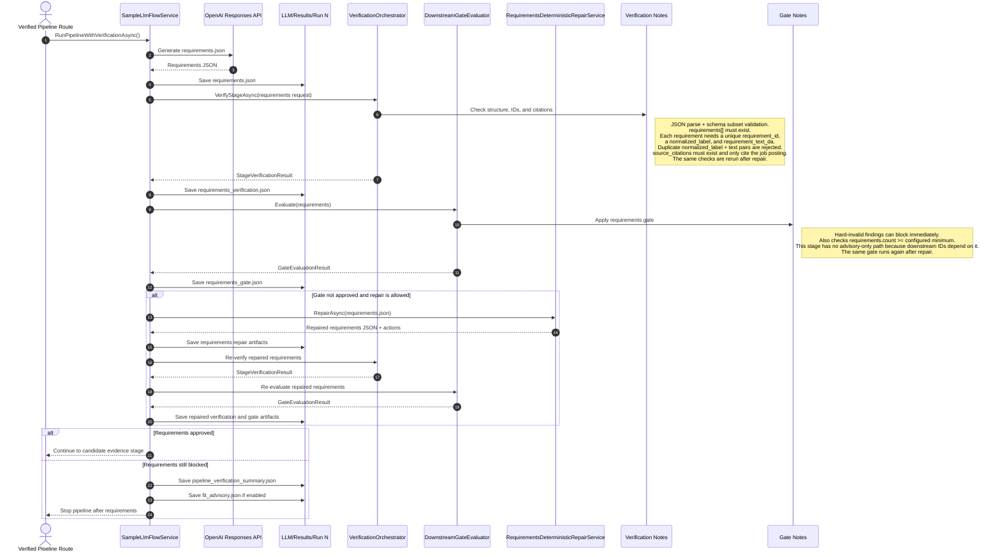
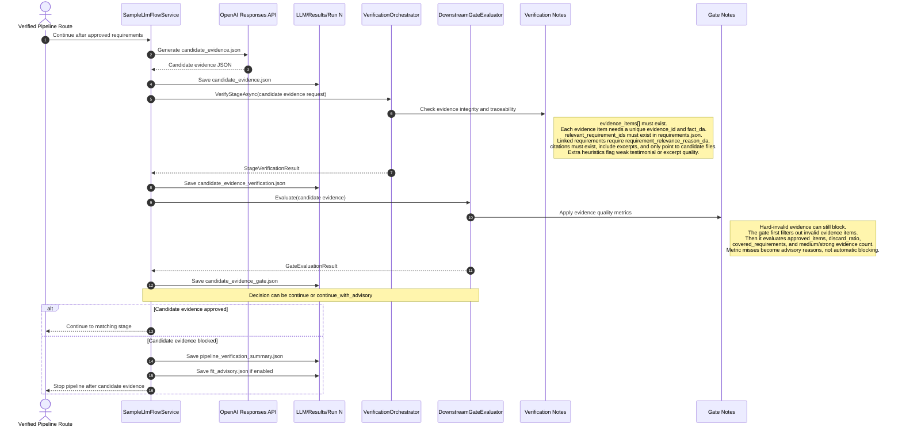
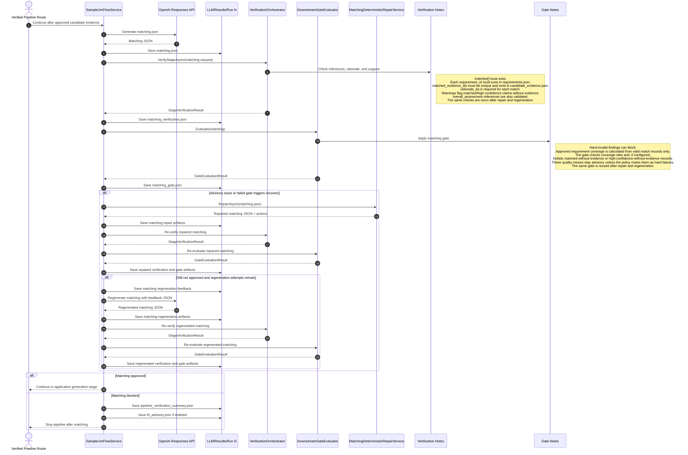
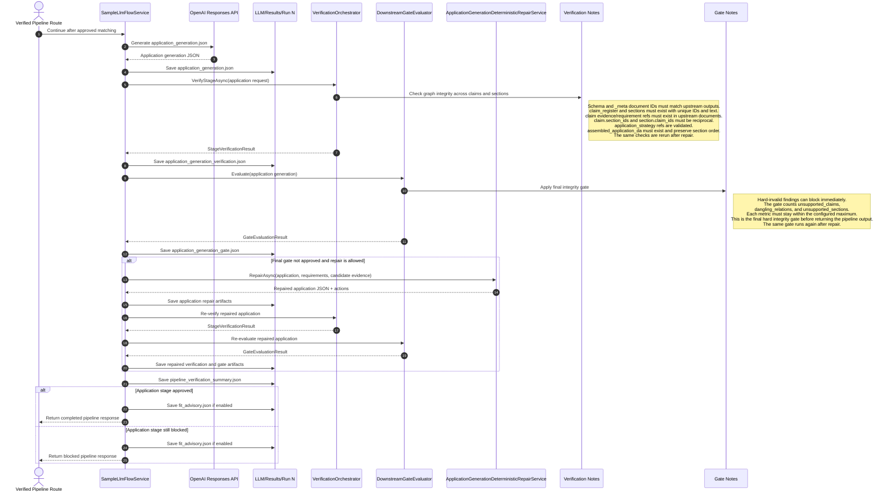

# Verification Stage Sequence Diagrams

This document visualizes the currently implemented verification flow in the verified sample pipeline.

Each diagram starts when a stage is executed inside `SampleLlmFlowService` and follows the stage output through persistence, mechanical verification, gate evaluation, and any stage-specific recovery logic.

## Requirements Stage

## Candidate Evidence Stage

## Matching Stage

## Application Generation Stage

## Notes

- Requirements is the hardest prerequisite stage because downstream IDs depend on it.
- Candidate evidence can continue with advisory quality signals, but mechanical integrity failures still block.
- Matching can use deterministic repair first and regeneration second.
- Application generation is allowed to complete only after its internal claim and section references are consistent enough for the final gate.